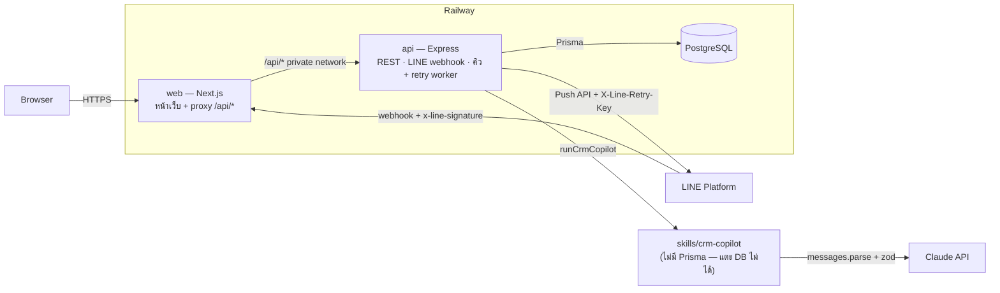
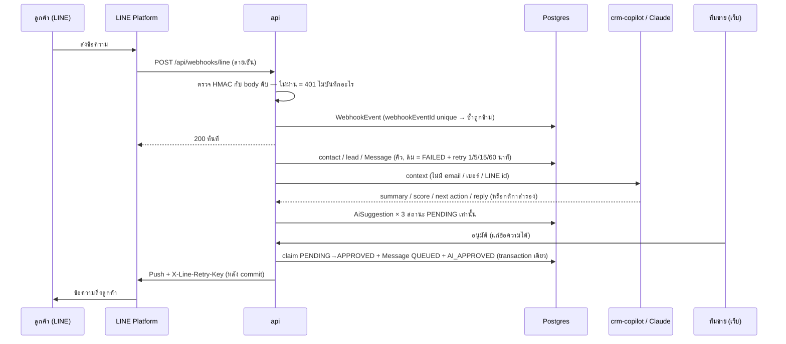

# AI CRM

AI CRM MVP สำหรับทีมขาย 20 คน (~2,000 contacts, 300 active leads) ที่ lead เข้ามา 3 ทาง — ฟอร์มหน้าเว็บ, ทีมขายบันทึกเอง และ LINE OA — รวมไว้ที่เดียว มี timeline ของทุกการคุย และ AI Copilot ที่สรุป / ให้คะแนน / แนะนำงานถัดไป / ร่างคำตอบ LINE โดย**ทุกอย่างที่ AI เสนอต้องมีคนอนุมัติก่อนจึงจะเปลี่ยนข้อมูลหรือส่งถึงลูกค้า**

Next.js 16 (`apps/web`) · Express 5 (`apps/api`) · Prisma 7 + PostgreSQL 17 · zod (`packages/shared`) · Claude ผ่าน `@anthropic-ai/sdk` (`skills/crm-copilot`) · LINE Messaging API · pnpm workspaces · Railway

> **เริ่มใช้งานครั้งแรก / ไม่เคย setup มาก่อน → [docs/setup-guide.md](docs/setup-guide.md)** คู่มือทีละขั้น: เตรียมเครื่อง → รันบนเครื่อง → เอา `ANTHROPIC_API_KEY` → ลอง LINE (แบบจำลอง / LINE จริงคุยกับระบบบนเครื่องผ่าน tunnel) → deploy ครั้งแรกบน Railway → ต่อ LINE OA เข้า production → ขั้นตอนเมื่อมีการแก้ไข → แก้ปัญหาที่พบบ่อย

## Demo

| | |
|---|---|
| URL | ใส่หลัง deploy (setup-guide ส่วนที่ 5) |
| บัญชี | `admin@demo.local` (admin), `sales01@demo.local` … `sales19@demo.local` — รหัสผ่านคือ `SEED_DEMO_PASSWORD` ที่ตั้งตอน seed (ส่งแยก ไม่อยู่ใน repo) |
| ฟอร์มสาธารณะ | `/contact-us` (ไม่ต้อง login) |
| LINE | สแกน QR ของ OA (setup-guide ส่วนที่ 6) หรือทดลองในเครื่อง: แบบจำลองด้วย `pnpm line:simulate` / ทักจากมือถือจริงผ่าน tunnel (setup-guide ส่วนที่ 4) |
| ข้อมูล | สังเคราะห์ทั้งหมด (seed แบบ fixed seed) — ไม่มีข้อมูลลูกค้าจริง |

## ทำอะไรได้บ้าง

**CRM** — Leads (ค้นหา / กรองตาม stage, เจ้าของ, ที่มา, คะแนน / เรียง / แบ่งหน้า), Pipeline board, หน้า lead (ย้าย stage ตามกติกา `New → Qualified → Proposal → Won | Lost` — Lost ต้องมีเหตุผล, timeline รวมกิจกรรมและข้อความ, บันทึก note / call / meeting / task), Contacts, Companies — ใช้บนมือถือได้ ทุกการเปลี่ยนแปลงสำคัญลง timeline พร้อมผู้ทำ

**AI Copilot** ([skills/crm-copilot/SKILL.md](skills/crm-copilot/SKILL.md)) — กด "ขอคำแนะนำจาก AI" ได้ 3 การ์ด "รออนุมัติ": สรุป + คะแนน 0–100 พร้อมเหตุผล, งานถัดไป, ร่างข้อความ LINE — แก้ก่อนอนุมัติได้ อนุมัติแล้วจึงบันทึก / สร้างงาน / ส่ง LINE และลง audit trail; AI ใช้ไม่ได้ (ไม่มี key, timeout, error, output ผิดรูป) → กติกาสำรองที่ติดป้ายชัดเจนและยังต้องอนุมัติเหมือนเดิม

**LINE OA** — ตรวจลายเซ็น webhook, บันทึก event ครั้งเดียว, ผูก LINE user → contact → lead (สร้างให้ถ้ายังไม่มี), ข้อความขึ้น timeline, AI ร่างคำตอบอัตโนมัติรออนุมัติ, คนพิมพ์ตอบเองได้, ส่งไม่สำเร็จ → retry อัตโนมัติ + ปุ่มส่งอีกครั้ง (retry key เดิม ลูกค้าไม่ได้ซ้ำ)

## Architecture



- `apps/api` เป็นที่เดียวที่ต่อ DB; ทุก request (browser และ LINE) เข้าทาง `web` แล้ว rewrite `/api/*` ไป `api` ผ่าน private network → cookie เป็น first-party ไม่ต้องเปิด CORS, `api` ไม่มี public domain และ `TRUST_PROXY=2` (Railway edge + Next) ถูกทุก request (ทดสอบบน production image แล้วว่า rewrite ส่ง body ดิบ + `x-line-signature` ครบ ลายเซ็น LINE ผ่าน)
- `packages/shared` มี zod schema ของทุก request / response / enum / กติกา stage — API validate และเว็บ parse ด้วย schema ชุดเดียวกัน
- `skills/crm-copilot` เป็น pure package: รับ CRM context คืน structured output ที่ผ่าน zod — **ไม่มีทางเขียน DB หรือส่ง LINE เอง** (บังคับด้วยโครงสร้าง dependency ไม่ใช่แค่วินัย)

### ข้อความ LINE → ร่าง AI → อนุมัติ → ส่ง



Data model อยู่ที่ [apps/api/prisma/schema.prisma](apps/api/prisma/schema.prisma) — เหตุผลของตาราง `AiSuggestion` (กำแพงระหว่าง AI กับข้อมูลจริง + audit) และ `WebhookEvent` (idempotency + retry + replay) อยู่ในแผน (`docs/plans/2026-09-13-mvp-plan.md` หัวข้อ 1); CHECK constraints (score 0–100, value ≥ 0, Lost ต้องมีเหตุผล, closedAt ตรงกับ stage) และ partial unique index (PENDING ได้ทีละ 1 ต่อ lead ต่อประเภท) อยู่ใน migration

## Quick start (local)

สำหรับคนที่คุ้นเครื่องมืออยู่แล้ว — ถ้าไม่แน่ใจขั้นไหน ดูคำอธิบายละเอียดที่ setup-guide ส่วนที่ 1–4

ต้องมี Node ≥ 22.12, pnpm 11 และ Docker

```bash
cp apps/api/.env.example apps/api/.env          # ตั้ง SEED_DEMO_PASSWORD (≥ 12 ตัว) และ JWT_SECRET
cp apps/web/.env.example apps/web/.env.local

pnpm install
pnpm db:up          # Postgres ใน Docker (ai_crm + ai_crm_test)
pnpm db:generate    # Prisma Client
pnpm db:deploy      # apply migrations
pnpm db:seed        # ข้อมูลสังเคราะห์ (20 users, ~150 companies, 2,000 contacts, ~450 leads)
pnpm dev            # web http://localhost:3000 · api http://localhost:4000
```

- **AI**: ไม่ใส่ `ANTHROPIC_API_KEY` ก็ใช้ได้ (กติกาสำรอง) — ใส่ใน `apps/api/.env` แล้ว restart เพื่อใช้ Claude (`/api/health` จะบอก `"ai":"claude"`); eval: `pnpm --filter @ai-crm/crm-copilot eval`
- **LINE ในเครื่อง** (ข้อความขาออกเป็นแบบจำลอง): ใส่ `LINE_CHANNEL_SECRET=<ค่าอะไรก็ได้>` ใน `apps/api/.env` แล้ว

  ```bash
  pnpm line:simulate "สวัสดีครับ สนใจทำเว็บไซต์ใหม่"   # ลูกค้าใหม่ทักมา → Leads กรองที่มา LINE
  pnpm line:simulate "ข้อความเดิม" --repeat 2          # LINE ส่ง event ซ้ำ → บันทึกครั้งเดียว
  pnpm line:simulate "ปลอม" --bad-signature           # ลายเซ็นผิด → 401
  ```

- **LINE จริง + ระบบบนเครื่อง**: ใส่ `LINE_MODE=live` + channel secret / access token จริงใน `apps/api/.env` → `cloudflared tunnel --url http://localhost:4000` → ตั้ง Webhook URL เป็น `https://<คำสุ่ม>.trycloudflare.com/api/webhooks/line` → ทักจากมือถือ (setup-guide ข้อ 4.2–4.6)
- เรียก API ด้วยมือ: [apps/api/requests.http](apps/api/requests.http) (VS Code REST Client)
- production image ชุดเดียวกับ Railway: `JWT_SECRET=$(openssl rand -base64 48) docker compose -f docker-compose.prod.yml up --build` → http://localhost:3100
- deploy ครั้งแรก / เมื่อมีการแก้ไขหลัง deploy: setup-guide ส่วนที่ 5–7 (Railway: Postgres + `api` ไม่มี domain + `web` มี domain, ตั้งค่าผ่านหน้าเว็บ Railway)

## Environment variables

`apps/api` (ดูคำอธิบายใน [.env.example](apps/api/.env.example)) — ตรวจด้วย zod ตอน start ผิดแล้วหยุดทันทีโดยบอกแค่ชื่อ key

| Key | บังคับ | หมายเหตุ |
|---|---|---|
| `DATABASE_URL` | ✓ | Postgres |
| `JWT_SECRET` | ✓ | ≥ 32 ตัวอักษร เซ็น session |
| `PORT`, `LOG_LEVEL`, `SESSION_TTL_HOURS`, `TRUST_PROXY` | | default 4000 / info / 8 / 1 (Railway = 2) |
| `ANTHROPIC_API_KEY` | | ว่าง = กติกาสำรอง |
| `AI_MODEL`, `AI_EFFORT`, `AI_TIMEOUT_MS` | | default `claude-sonnet-5` / `medium` / 25000 |
| `LINE_MODE` | | `mock` (default) / `live` |
| `LINE_CHANNEL_SECRET` | live | ว่าง = webhook ตอบ 503 |
| `LINE_CHANNEL_ACCESS_TOKEN` | live | |
| `SEED_DEMO_PASSWORD` | seed | รหัสผ่านบัญชี demo |
| `TEST_DATABASE_URL` | test | ชื่อ DB ต้องลงท้าย `_test` (test ล้างข้อมูลทุกครั้ง) |

`apps/web`: `API_URL` (ตอน build — ปลายทางของ rewrite `/api/*`)

## API notes

prefix `/api` · JSON · ทุก route validate `params` / `query` / `body` ด้วย zod ก่อนเข้า logic · error รูปแบบเดียว `{ "error": { "code", "message", "details"? } }` (400 validation พร้อม `details.issues[{path,message}]`, 401, 403, 404, 409 สถานะชนกัน, 429, 503) · session เป็น httpOnly cookie · 🔓 public 👤 login 🛡️ admin

| Method | Path | | ใช้ทำอะไร |
|---|---|---|---|
| GET | `/health` | 🔓 | สถานะ + DB + โหมด AI / LINE |
| POST | `/auth/login` · `/auth/logout` | 🔓 · 👤 | ตั้ง / ล้าง cookie (login จำกัด 10 ครั้งที่ผิด / 15 นาที) |
| GET | `/auth/me` · `/users` | 👤 | ผู้ใช้ปัจจุบัน · รายชื่อสำหรับเลือกเจ้าของ |
| GET POST | `/leads` | 👤 | list (`q`, `stage`, `ownerId=me\|unassigned\|id`, `source`, `minScore`, `sort`, cursor) · สร้าง (พร้อม contact ใหม่ได้) |
| GET | `/leads/pipeline` | 👤 | จำนวน + มูลค่ารวมต่อ stage |
| GET PATCH | `/leads/:id` | 👤 | รายละเอียด · แก้ (owner / score / value ลง audit) |
| PATCH | `/leads/:id/stage` | 👤 | ย้าย stage ตามกติกา (ผิด = 409 พร้อม stage ที่ไปได้) |
| GET POST | `/leads/:id/timeline` · `/leads/:id/activities` | 👤 | timeline (activity + message) · เพิ่ม note / call / meeting / task |
| PATCH | `/activities/:id/complete` | 👤 | ปิด task |
| GET POST PATCH / DELETE | `/companies[/:id]` · `/contacts[/:id]` | 👤 / 🛡️ | CRUD (ลบได้เฉพาะ admin และ 409 ถ้ายังมีการอ้างอิง) |
| POST GET | `/leads/:id/ai-suggestions` | 👤 | ขอคำแนะนำ (จำกัด 20 / นาที / คน) · ประวัติ |
| POST | `/ai-suggestions/:id/approve` · `/reject` | 👤 | อนุมัติ (แก้ได้เฉพาะ field ของประเภทนั้น) · ไม่ใช้ (พร้อมเหตุผล) — ซ้ำ / ถูกแทนแล้ว = 409 |
| POST | `/leads/:id/messages` · `/messages/:id/retry` | 👤 | พิมพ์ตอบทาง LINE · ส่งข้อความที่ FAILED ใหม่ (retry key เดิม) |
| POST | `/webhooks/line` | 🔓 ลายเซ็น | รับ event จาก LINE |
| GET POST | `/webhook-events` · `/webhook-events/:id/retry` | 🛡️ | ดู event ตามสถานะ · สั่งประมวลผลใหม่ |
| POST | `/public/leads` | 🔓 | ฟอร์ม "ติดต่อเรา" (จำกัด 5 / 10 นาที / IP, honeypot, ต้องยินยอม PDPA) |
| GET | `/ops/summary` | 🛡️ | ตัวเลขสำหรับ monitor (ความหมาย / เกณฑ์ alert อยู่ใน monitoring notes) |

ตัวอย่างครบทุก endpoint: [apps/api/requests.http](apps/api/requests.http)

## Tests

```bash
pnpm lint && pnpm typecheck && pnpm test && pnpm build   # CI รันชุดเดียวกันทุก push / PR
```

199 tests (Vitest; API ใช้ Postgres จริงใน DB `ai_crm_test` + supertest, LINE / AI ใช้ mock adapter เท่านั้น) — test ที่โจทย์บังคับ:

| # | เรื่อง | ไฟล์ |
|---|---|---|
| 1 | Core CRM flow — login → สร้าง lead → ย้าย stage ผิดกติกา 409 → Lost ไม่มีเหตุผล 400 → ย้ายถูก → timeline มี STAGE_CHANGE พร้อมผู้ทำ | [apps/api/src/modules/leads/leads.test.ts](apps/api/src/modules/leads/leads.test.ts) |
| 2 | AI skill behavior / fallback — timeout / error / refusal / output ผิดรูป → กติกาสำรอง, ก่อนอนุมัติไม่มีข้อมูลเปลี่ยน, อนุมัติซ้ำ 409, ส่ง LINE ครั้งเดียว, guardrail (ราคา / prompt injection / ภาษา), eval 7 เคส | [apps/api/src/modules/ai/ai.test.ts](apps/api/src/modules/ai/ai.test.ts), [skills/crm-copilot/src/copilot.test.ts](skills/crm-copilot/src/copilot.test.ts), [evals](skills/crm-copilot/evals/) |
| 3 | LINE webhook security / idempotency — ลายเซ็นผิด / ไม่มี / body ถูกแก้ = 401 ไม่บันทึก, event ซ้ำ (พร้อมกัน) บันทึกครั้งเดียว, message id ซ้ำ, mapping contact / lead ครั้งเดียว, ล้มแล้ว retry | [apps/api/src/modules/line/webhook.test.ts](apps/api/src/modules/line/webhook.test.ts) |

test สำคัญของ security ผ่าน mutation test แล้ว (แก้โค้ดให้ยอมรับทุกลายเซ็น / ปิดการกันซ้ำ → test ล้มจริง) — ดู AI-usage log #8

## Security

- **Auth**: bcrypt, JWT ใน httpOnly + SameSite=Lax cookie (Secure บน production), โหลด user จาก DB ทุก request (ปิดบัญชีแล้วหลุดทันที), rate limit login ต่อ IP + email, ตอบเหมือนกันทั้งอีเมลไม่มีจริง / รหัสผิด (เวลาเท่ากัน), `?next=` ตรวจกัน open redirect
- **Input**: zod ทุก endpoint (`strict` ใน body ที่สำคัญ), error 5xx ไม่ส่งรายละเอียดภายใน, body จำกัดขนาด
- **AI**: ข้อความลูกค้าเป็น data ไม่ใช่คำสั่ง (ห่อใน `<crm_context>` + escape), ตรวจ prompt injection, reply ที่มีราคา / ส่วนลดที่ทีมไม่ได้ให้ถูกแทนด้วยข้อความกลาง, ไม่ส่ง email / เบอร์ / LINE id ให้ AI, output ผ่าน zod ก่อนบันทึก, **ทุกผลลัพธ์ต้องมีคนอนุมัติ**
- **LINE**: HMAC-SHA256 กับ body ดิบ + เทียบเวลาคงที่, event / message id ซ้ำถูกข้าม, retry key กันส่งซ้ำ
- **HTTP**: helmet (API), CSP / HSTS / X-Frame-Options / nosniff / Referrer-Policy (web), ไม่เปิด CORS, ฟอร์มสาธารณะมี rate limit + honeypot + consent
- **Secrets**: อ่านจาก env เท่านั้น, log redact cookie / authorization / x-line-signature, สแกนประวัติ git แล้วไม่มี secret
- **Dependencies**: `pnpm audit --prod` เจอ 3 รายการ (mysql2, deepmerge-ts) ทั้งหมดอยู่ใน Prisma CLI ที่ใช้ตอน migrate — Prisma 7.10.0 (ล่าสุดของ 7.x) pin เวอร์ชันนี้ไว้เอง, mysql2 ใช้เฉพาะต่อ MySQL (เราใช้ Postgres) และ deepmerge-ts รวมแค่ config ของเราเอง จึงไม่รับ input จากภายนอก → **ยอมรับความเสี่ยงไว้ก่อน ไม่ override dependency ภายในของ Prisma** (เสี่ยงทำ migrate พัง) และอัปเกรดเมื่อ Prisma ออก patch / 8.0 stable

## Key trade-offs

| เลือก | แทน | เพราะ |
|---|---|---|
| Express + Next แยก service, web proxy `/api` | API route ใน Next | ตามโจทย์ + webhook / worker รันต่อเนื่อง ไม่ cold start; cookie first-party ไม่ต้อง CORS |
| AI ร่าง → คนอนุมัติทุกครั้ง (ตาราง `AiSuggestion`) | ให้ AI เขียน / ส่งเองเมื่อมั่นใจ | ข้อผูกมัดกับลูกค้า (ราคา / วันส่งมอบ) ต้องเป็นของคน + audit ครบ + วัด approve / edit rate ได้ |
| เรียก AI ครั้งเดียวได้ 3 คำแนะนำ | เรียกแยกตามประเภท | เร็วและถูกกว่า; ข้อความ LINE รัวๆ รวบเป็นร่างรอบเดียว |
| กติกาสำรองแบบ rule-based | ปิดฟีเจอร์เมื่อ AI ล่ม | ทีมขายยังทำงานต่อได้ และเห็นชัดว่าไม่ใช่ AI |
| คิว + retry worker ในหน่วยความจำ (event อยู่ใน DB ก่อนตอบ LINE) | Redis / queue service | MVP instance เดียว ไม่เพิ่ม infra; งานไม่หายตอน restart |
| LINE Push API + retry key | reply token | reply token หมดอายุก่อนคนอนุมัติทัน |
| `fetch` + zod ตาม OpenAPI ของ LINE | `@line/bot-sdk` | ใช้แค่ 3 อย่าง (push, profile, ลายเซ็น) test ด้วย fetch ปลอมได้ตรงๆ |
| JWT cookie ไม่มี session store | server session | ง่ายและพอสำหรับ 20 คน (ดูข้อจำกัด) |
| UI เขียนเองบน element ของ browser | shadcn / react-hook-form | dependency น้อย ฟอร์มใช้ schema เดียวกับ API |
| ตั้งค่า Railway ในหน้าเว็บ (ขั้นตอนอยู่ใน setup-guide) | `railway.json` / IaC | Config as Code (`railway.json`) ใช้กับ service ใหม่ไม่ได้แล้ว (เอกสาร Railway 2026-09); IaC (`.railway/railway.ts`) ยังทดสอบกับบัญชีจริงไม่ได้ → next step ข้อ 7 |

## Known limitations

- ต้องรัน `api` instance เดียว (คิว LINE, retry worker, rate limit อยู่ในหน่วยความจำ)
- logout ลบแค่ cookie — JWT ที่ถูกขโมยใช้ได้จนหมดอายุ (8 ชม.)
- ยังไม่มีสิทธิ์ราย lead (sales ทุกคนเห็น / แก้ lead ทุกตัว) และหน้า admin บนเว็บ (ใช้ API แทน)
- LINE: รองรับข้อความ 1:1 (ไม่รับ group / room), ไฟล์ / รูปบันทึกเป็นข้อความแทน "[รูปภาพ]" ไม่เก็บไฟล์, retry key ใช้ได้ 24 ชม. (กด "ส่งอีกครั้ง" หลังจากนั้น ถ้าครั้งแรก LINE รับไปแล้วจริง ลูกค้าอาจได้ซ้ำ)
- ยังไม่ได้รัน eval กับ Claude จริงในเครื่องที่พัฒนา (ไม่มี API key) — eval และ test รันกับกติกาสำรอง / Claude provider ผ่าน SDK จริงกับ fetch ปลอม
- image ของ `api` ใหญ่ (~950MB) เพราะเก็บ Prisma CLI ไว้ migrate
- ค่าตั้งค่าของ Railway (Dockerfile path, pre-deploy, healthcheck, watch paths) อยู่ในหน้าเว็บ Railway ไม่ได้อยู่ใน repo — ตั้งตาม setup-guide ข้อ 5.4–5.5
- บัญชี Railway แบบ Limited Trial จำกัดการออกอินเทอร์เน็ต → เรียก Claude / LINE ไม่ได้ (AI ใช้กติกาสำรอง, ส่ง LINE ไม่สำเร็จ) ต้องใช้แผน Hobby ขึ้นไป

## Production next steps

1. queue จริง (เช่น pg-boss / BullMQ) แทนคิวในหน่วยความจำ → scale `api` ได้, แยก worker
2. session ฝั่ง server หรือ token denylist + สิทธิ์ราย lead / ทีม
3. error tracking (Sentry) + metrics / tracing (OpenTelemetry) + alert จาก `/api/ops/summary`
4. รัน eval กับ Claude จริงใน CI (มี budget) และเก็บ approve / edit rate เป็น dataset ปรับ prompt
5. เก็บรูป / ไฟล์จาก LINE, รองรับ group, rich message / quick reply
6. แยก image สำหรับ migrate ให้ image ของ `api` เล็กลง, อัปเกรด Prisma เมื่อมี patch ของ advisory
7. ย้ายค่าตั้งค่า Railway เข้า repo ด้วย Infrastructure as Code (`.railway/railway.ts`) เพื่อ review / ย้อนได้เหมือนโค้ด

## เอกสาร

| ไฟล์ | เนื้อหา |
|---|---|
| [docs/setup-guide.md](docs/setup-guide.md) | **คู่มือทีละขั้นสำหรับผู้เริ่มต้น**: เตรียมเครื่อง, รันบนเครื่อง, `ANTHROPIC_API_KEY`, LINE (จำลอง / LINE จริงผ่าน tunnel), deploy ครั้งแรกบน Railway, เมื่อมีการแก้ไข, แก้ปัญหา, เช็กลิสต์ส่งงาน |
| [docs/monitoring.md](docs/monitoring.md) | monitoring notes: health, log ที่ระบบเขียน, ตัวเลขที่ควร alert |
| [skills/crm-copilot/SKILL.md](skills/crm-copilot/SKILL.md) | AI skill: inputs / outputs / allowed actions / guardrails / failure behavior / eval cases |
| [docs/plans/2026-09-13-mvp-plan.md](docs/plans/2026-09-13-mvp-plan.md) | แผน 6 phase, schema, endpoint และสิ่งที่เปลี่ยนจากแผนระหว่างทำ |
| [docs/ai-usage-log.md](docs/ai-usage-log.md) | บันทึกการใช้ AI: prompt, สิ่งที่ AI ทำ, สิ่งที่คน review / reject |
| [CLAUDE.md](CLAUDE.md) | คู่มือและกติกาของ repo สำหรับ AI coding agent (ใช้ต่อได้) |
