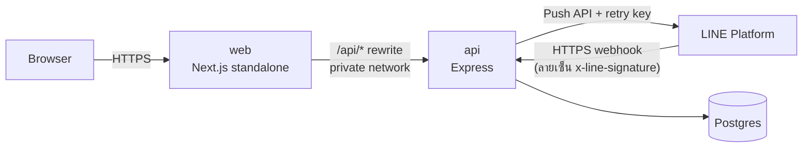

# Deploy บน Railway

> ขั้นตอนในหน้านี้ต้องใช้บัญชี Railway และ GitHub ของเจ้าของ repo — ส่วน build/deploy config อยู่ใน repo แล้ว (config as code)
> ทดสอบ image ชุดเดียวกันในเครื่องได้ก่อนด้วย [docker-compose.prod.yml](../docker-compose.prod.yml)

## ภาพรวม



Railway project เดียว มี 3 service

| Service | ที่มา | Config file | Public domain |
|---|---|---|---|
| `Postgres` | Railway database | — | ไม่ต้องเปิด |
| `api` | repo นี้ | `/apps/api/railway.json` | เปิด (ใช้เป็น LINE webhook URL) |
| `web` | repo นี้ | `/apps/web/railway.json` | เปิด — เป็น URL ของ demo |

browser คุยกับ `web` อย่างเดียว (`/api/*` ถูก proxy ไป `api` ผ่าน private network) → session cookie เป็น first-party และไม่ต้องเปิด CORS

## ขั้นตอน (ครั้งแรก)

1. **Push branch ขึ้น GitHub** ให้ Railway เข้าถึง repo ได้
2. **สร้าง project** → New Project → Deploy PostgreSQL (ตั้งชื่อ service ว่า `Postgres`)
3. **Service `api`** → + New → GitHub Repo → เลือก repo นี้ → เปลี่ยนชื่อ service เป็น `api`
   - Settings → Source: **Root Directory เว้นว่าง** (Dockerfile ต้องใช้ root ของ repo เป็น build context)
   - Settings → Config-as-code → Railway Config File: `/apps/api/railway.json` (ต้องเป็น path เต็มจาก root)
   - Variables:

     | Key | Value |
     |---|---|
     | `DATABASE_URL` | `${{Postgres.DATABASE_URL}}` |
     | `JWT_SECRET` | สร้างด้วย `openssl rand -base64 48` แล้วใส่ใน Railway เท่านั้น |
     | `PORT` | `4000` (ตายตัว เพื่อให้ `web` อ้างถึงได้) |
     | `TRUST_PROXY` | `2` (Railway edge + Next proxy) |
     | `SESSION_TTL_HOURS` | `8` |
     | `ANTHROPIC_API_KEY` | key ของ Anthropic (ไม่ใส่ = ใช้กติกาสำรอง ระบบยังทำงานครบ) |
     | `AI_MODEL` | `claude-sonnet-5` (ไม่ใส่ก็ได้ — เป็นค่า default) |
     | `AI_EFFORT` / `AI_TIMEOUT_MS` | ไม่ใส่ก็ได้ — default `medium` / `25000` |
     | `LINE_MODE` | `mock` ไปก่อน — เปลี่ยนเป็น `live` ตามหัวข้อ [LINE OA](#line-oa) |
     | `LINE_CHANNEL_SECRET` / `LINE_CHANNEL_ACCESS_TOKEN` | ใส่ตอนตั้งค่า [LINE OA](#line-oa) (ไม่ใส่ secret = webhook ตอบ 503) |

   - Networking → Generate Domain
4. **Service `web`** → + New → GitHub Repo (repo เดิม) → ชื่อ `web`
   - Root Directory เว้นว่าง, Railway Config File: `/apps/web/railway.json`
   - Variables: `API_URL` = `http://${{api.RAILWAY_PRIVATE_DOMAIN}}:4000`
     (ใช้ตอน **build** — rewrite ของ Next ถูกเขียนลง output ตอน build; Dockerfile รับผ่าน `ARG API_URL`)
   - Networking → Generate Domain → นี่คือ URL ของ demo
5. **Deploy** — `api` รัน `preDeployCommand` (`prisma migrate deploy`) ก่อนสลับเวอร์ชันทุกครั้ง; ใน deploy log ต้องเห็น `All migrations have been successfully applied`
6. **Seed ข้อมูล demo ครั้งเดียว** (ข้อมูลสังเคราะห์) จากเครื่อง local
   - Postgres service → Connect → คัดลอก URL แบบ public (`DATABASE_PUBLIC_URL`)
   - ```bash
     DATABASE_URL='<public url>' SEED_DEMO_PASSWORD='<รหัสผ่าน demo ≥ 12 ตัว>' \
       ALLOW_PRODUCTION_SEED=true NODE_ENV=production pnpm db:seed
     ```
   - seed ไม่ยอมรันกับ production ถ้าไม่มี `ALLOW_PRODUCTION_SEED=true` และไม่ยอมล้าง DB ที่มีข้อมูลแล้วถ้าไม่มี `-- --reset`
7. **ตรวจ**
   - `curl https://<api-domain>/api/health` → `{"status":"ok","db":"up","ai":"claude","line":"mock"}` (`ai` เป็น `fallback` ถ้าไม่ได้ใส่ key)
   - เปิด web URL → login ด้วยบัญชี demo → ย้าย stage ของ lead → Railway: Restart ทั้ง `web` และ `api` → refresh → ข้อมูลยังอยู่
   - หน้า lead → **ขอคำแนะนำจาก AI** → การ์ดต้องบอกชื่อ model และเวลาที่ใช้ (ถ้าขึ้น "กติกาสำรอง" ให้ดูเหตุผลบนการ์ด และดู log ของ `api` ที่ข้อความ `ai suggestions generated`)

## LINE OA

ทำหลัง `api` deploy และมี public domain แล้ว (webhook ต้องเป็น HTTPS ที่มี certificate จริง — domain ของ Railway ใช้ได้)

1. **สร้าง LINE Official Account** (test account ของเราเอง) ที่ https://account.line.biz/signup → เข้า **LINE Official Account Manager** → เปิดใช้ Messaging API (ระบบสร้าง Messaging API channel ให้ — ตั้งแต่ ก.ย. 2024 สร้าง channel ตรงจาก LINE Developers Console ไม่ได้แล้ว)
2. **LINE Developers Console** → provider → channel ของ OA
   - แท็บ **Basic settings** → คัดลอก **Channel secret**
   - แท็บ **Messaging API** → ออก **Channel access token (long-lived)**
3. **Railway → `api` → Variables** (ใส่ที่นี่ที่เดียว ห้าม commit / ห้ามส่งในแชต)

   | Key | Value |
   |---|---|
   | `LINE_MODE` | `live` |
   | `LINE_CHANNEL_SECRET` | ค่าจากข้อ 2 |
   | `LINE_CHANNEL_ACCESS_TOKEN` | ค่าจากข้อ 2 |

   api จะไม่ start ถ้า `LINE_MODE=live` แต่ขาดค่าใดค่าหนึ่ง (ตรวจตอนเริ่ม) → `curl https://<api-domain>/api/health` ต้องได้ `"line":"live"`
4. **ตั้ง webhook** — แท็บ **Messaging API** → Webhook URL: `https://<api-domain>/api/webhooks/line` → **Verify** ต้องขึ้น **Success** (LINE ส่ง `events: []` ที่เซ็นแล้ว → api ตอบ 200) → เปิด **Use webhook** (แนะนำเปิด webhook redelivery ด้วย — ระบบกัน event ซ้ำไว้แล้ว)
5. **ปิดการตอบอัตโนมัติของ OA** — LINE Official Account Manager → **Messaging API Settings** → **Greeting messages** และ **Auto-reply messages** = Disabled (ไม่งั้น OA ตอบลูกค้าเองซ้อนกับทีมขาย)
6. **ทดสอบจากมือถือ** — สแกน QR code ในแท็บ **Messaging API** เพื่อเพิ่มเพื่อน → ส่งข้อความ → ในเว็บ: Leads กรองที่มา LINE → เปิด lead → เห็นข้อความ + ร่างคำตอบของ AI → อนุมัติ → ข้อความถึงมือถือ
7. **ถ้าข้อความไม่ขึ้น** — ดู log ของ `api` (`line webhook received` / `line webhook rejected: invalid signature` = channel secret ไม่ตรง) และ `GET /api/webhook-events?status=FAILED` ด้วยบัญชี admin; ส่งไม่ถึงลูกค้า → ข้อความใน timeline ขึ้น "ส่งไม่สำเร็จ" พร้อมเหตุผลจาก LINE (เช่น 401 = token ผิด) กด "ส่งอีกครั้ง" ได้หลังแก้

## หลังจากนั้น

- Railway deploy ใหม่เองเมื่อ push เข้า branch ที่ผูกไว้ — `watchPatterns` ใน `railway.json` ทำให้แก้ `apps/web` ไม่ trigger `api` (และกลับกัน); แก้ `skills/` trigger เฉพาะ `api`
- เปลี่ยนชื่อ service `api` หรือ `PORT` → ต้อง redeploy `web` ด้วย (เพราะ `API_URL` อยู่ใน build)
- secret ทั้งหมด (`JWT_SECRET`, `LINE_CHANNEL_SECRET`, `LINE_CHANNEL_ACCESS_TOKEN`, `ANTHROPIC_API_KEY`) ใส่ใน Railway Variables เท่านั้น ห้าม commit — ถ้าหลุด ให้ออกใหม่ใน console ของผู้ให้บริการแล้วเปลี่ยนใน Railway

## ข้อจำกัดที่รู้อยู่

- image ของ `api` ยังใหญ่ (~960MB) เพราะเก็บ dev dependency ไว้ให้ pre-deploy ใช้ prisma CLI — next step: แยก image สำหรับ migrate
- `TRUST_PROXY=2` ตั้งไว้สำหรับ request ที่ผ่าน `web`; request ที่ยิงตรงเข้า public domain ของ `api` ปลอม `X-Forwarded-For` ได้ แต่ rate limit ของ login ยังนับราย email อยู่
- คิวประมวลผล LINE webhook และ retry worker อยู่ในหน่วยความจำของ process — อย่า scale `api` เกิน 1 replica จนกว่าจะย้ายไปใช้ queue (event ไม่หายตอน restart เพราะบันทึกลง DB ก่อนตอบ LINE และ worker เก็บงานค้างกลับมาทำ)
- retry key ของ LINE ใช้ได้ 24 ชม. — กด "ส่งอีกครั้ง" หลังจากนั้น ถ้าครั้งแรก LINE รับไปแล้วจริง ลูกค้าอาจได้ข้อความซ้ำ
