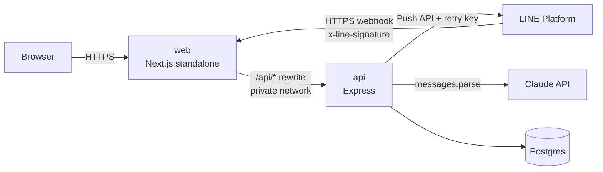

# Deploy บน Railway

> ขั้นตอนในหน้านี้ต้องใช้บัญชี GitHub / Railway / LINE ของเจ้าของ repo — build และ deploy config อยู่ใน repo แล้ว (config as code)
> ทดสอบ image ชุดเดียวกันในเครื่องก่อนได้ด้วย [docker-compose.prod.yml](../docker-compose.prod.yml) (ดูท้ายหน้า)

## ภาพรวม



Railway project เดียว มี 3 service

| Service | ที่มา | Config file | Public domain |
|---|---|---|---|
| `Postgres` | Railway database | — | ไม่เปิด |
| `api` | repo นี้ | `/apps/api/railway.json` | **ไม่เปิด** — ทุกอย่างเข้าผ่าน `web` |
| `web` | repo นี้ | `/apps/web/railway.json` | เปิด — URL ของ demo และ LINE webhook |

ทุก request (browser และ LINE) เข้าทาง `web` แล้วถูกส่งต่อไป `api` ผ่าน private network → session cookie เป็น first-party, ไม่ต้องเปิด CORS, `api` ไม่ถูกยิงตรงจากอินเทอร์เน็ต และ `TRUST_PROXY=2` (Railway edge + Next) ถูกต้องกับทุก request
(ทดสอบแล้วว่า rewrite ของ Next ส่ง body ดิบและ header `x-line-signature` ไปครบ — ลายเซ็น LINE ผ่าน)

## 1. เตรียม repo

แต่ละ phase อยู่บน branch ต่อกันเป็นเส้นตรง (`phase-1-…` → `phase-6-hardening-handover`) จึง fast-forward `main` ได้เลย

```bash
git status                      # ต้องสะอาด (docs/assignment.pdf ไม่ถูก track — ไม่ขึ้น GitHub)
git switch main
git merge --ff-only phase-6-hardening-handover
git remote add origin git@github.com:<account>/ai-crm.git   # repo ใหม่ว่างๆ บน GitHub
git push -u origin main
# (ไม่บังคับ) เก็บ branch ของแต่ละ phase ไว้ให้ดูประวัติ: git push origin 'phase-*'
```

GitHub Actions ([ci.yml](../.github/workflows/ci.yml)) จะรัน lint + typecheck + test + build กับ Postgres ทุก push

## 2. Railway (ครั้งแรก)

1. **New Project → Deploy PostgreSQL** → ตั้งชื่อ service ว่า `Postgres`
2. **+ New → GitHub Repo** → เลือก repo → ตั้งชื่อ service `api`
   - Settings → Source: **Root Directory เว้นว่าง** (Dockerfile ใช้ root ของ repo เป็น build context)
   - Settings → Config-as-code → Railway Config File: `/apps/api/railway.json`
   - **ไม่ต้อง Generate Domain**
   - Variables (secret ใส่ที่นี่ที่เดียว — ห้าม commit / ห้ามส่งในแชต):

     | Key | Value |
     |---|---|
     | `DATABASE_URL` | `${{Postgres.DATABASE_URL}}` |
     | `JWT_SECRET` | ผลของ `openssl rand -base64 48` |
     | `PORT` | `4000` (ตายตัว — `web` อ้างถึงพอร์ตนี้) |
     | `TRUST_PROXY` | `2` |
     | `SESSION_TTL_HOURS` | `8` |
     | `ANTHROPIC_API_KEY` | key ของ Anthropic — ไม่ใส่ก็ได้ (ใช้กติกาสำรอง ระบบยังทำงานครบ) |
     | `AI_MODEL` / `AI_EFFORT` / `AI_TIMEOUT_MS` | ไม่ใส่ก็ได้ — default `claude-sonnet-5` / `medium` / `25000` |
     | `LINE_MODE` | `mock` ไปก่อน → `live` ตามหัวข้อ [LINE OA](#line-oa) |

3. **+ New → GitHub Repo** (repo เดิม) → ตั้งชื่อ `web`
   - Root Directory เว้นว่าง, Railway Config File: `/apps/web/railway.json`
   - Variables: `API_URL` = `http://${{api.RAILWAY_PRIVATE_DOMAIN}}:4000`
     (ใช้ตอน **build** — rewrite ของ Next ถูกเขียนลง output ตอน build; Dockerfile รับผ่าน `ARG API_URL`)
   - Networking → **Generate Domain** → นี่คือ URL ของ demo
4. **Deploy** — `api` รัน `preDeployCommand` (`prisma migrate deploy`) ก่อนสลับเวอร์ชันทุกครั้ง; deploy log ต้องมี `All migrations have been successfully applied` และ `integrations configured`
5. **Seed ข้อมูล demo ครั้งเดียว** (ข้อมูลสังเคราะห์) จากเครื่อง local
   - Postgres service → Connect → คัดลอก URL แบบ public (`DATABASE_PUBLIC_URL`)
   - ```bash
     DATABASE_URL='<public url>' SEED_DEMO_PASSWORD='<รหัสผ่าน demo ≥ 12 ตัว>' \
       ALLOW_PRODUCTION_SEED=true NODE_ENV=production pnpm db:seed
     ```
   - seed ไม่ยอมรันกับ production ถ้าไม่มี `ALLOW_PRODUCTION_SEED=true` และไม่ยอมล้าง DB ที่มีข้อมูลแล้วถ้าไม่มี `-- --reset`
   - บัญชี demo: `admin@demo.local`, `sales01@demo.local` … `sales19@demo.local` — รหัสผ่านคือค่าที่ตั้งตอน seed (ส่งให้ผู้ประเมินแยกจาก repo)

## 3. Smoke test หลัง deploy

- [ ] `curl https://<web-domain>/api/health` → `{"status":"ok","db":"up","ai":"claude"|"fallback","line":"mock"|"live",…}`
- [ ] `curl -sI https://<web-domain>/login` มี `Content-Security-Policy`, `Strict-Transport-Security`, `X-Frame-Options`
- [ ] login ด้วยบัญชี demo → Leads ค้นหา / กรองได้ → เปิด lead → ย้าย stage (Lost ต้องมีเหตุผล)
- [ ] Railway: Restart ทั้ง `web` และ `api` → refresh → stage และ timeline ยังอยู่
- [ ] หน้า lead → **ขอคำแนะนำจาก AI** → การ์ดบอกชื่อ model และเวลาที่ใช้ (ขึ้น "กติกาสำรอง" = ไม่มี key หรือ AI ใช้ไม่ได้ — เหตุผลอยู่บนการ์ด) → อนุมัติคะแนน → timeline มี "อนุมัติคะแนนและสรุปจาก AI"
- [ ] เปิด `https://<web-domain>/contact-us` (ไม่ต้อง login) → ส่งฟอร์ม → Leads กรองที่มา "เว็บไซต์" เห็น lead ใหม่
- [ ] login เป็น `admin@demo.local` → `GET /api/ops/summary` ตอบตัวเลขได้ (ดู [monitoring.md](monitoring.md))
- [ ] LINE: ตามหัวข้อถัดไป

## LINE OA

ทำหลัง `web` มี domain แล้ว (webhook ต้องเป็น HTTPS ที่มี certificate จริง — domain ของ Railway ใช้ได้)

1. **สร้าง LINE Official Account** (test account ของเราเอง) ที่ https://account.line.biz/signup → เข้า **LINE Official Account Manager** → เปิดใช้ Messaging API (ระบบสร้าง Messaging API channel ให้ — ตั้งแต่ ก.ย. 2024 สร้าง channel ตรงจาก LINE Developers Console ไม่ได้แล้ว)
2. **LINE Developers Console** → provider → channel ของ OA
   - แท็บ **Basic settings** → คัดลอก **Channel secret**
   - แท็บ **Messaging API** → ออก **Channel access token (long-lived)**
3. **Railway → `api` → Variables**

   | Key | Value |
   |---|---|
   | `LINE_MODE` | `live` |
   | `LINE_CHANNEL_SECRET` | ค่าจากข้อ 2 |
   | `LINE_CHANNEL_ACCESS_TOKEN` | ค่าจากข้อ 2 |

   `api` จะไม่ start ถ้า `LINE_MODE=live` แต่ขาดค่าใดค่าหนึ่ง (ตรวจตอนเริ่ม) → `/api/health` ต้องได้ `"line":"live"`
4. **ตั้ง webhook** — แท็บ **Messaging API** → Webhook URL: `https://<web-domain>/api/webhooks/line` → **Verify** ต้องขึ้น **Success** (LINE ส่ง `events: []` ที่เซ็นแล้ว → ตอบ 200) → เปิด **Use webhook** (แนะนำเปิด webhook redelivery ด้วย — ระบบกัน event ซ้ำไว้แล้ว)
5. **ปิดการตอบอัตโนมัติของ OA** — LINE Official Account Manager → **Messaging API Settings** → **Greeting messages** และ **Auto-reply messages** = Disabled (ไม่งั้น OA ตอบลูกค้าเองซ้อนกับทีมขาย)
6. **ทดสอบจากมือถือ** — สแกน QR code ในแท็บ **Messaging API** เพื่อเพิ่มเพื่อน → ส่งข้อความ → ในเว็บ: Leads กรองที่มา LINE → lead ใหม่ที่ยังไม่มีเจ้าของ → เห็นข้อความ + ร่างคำตอบของ AI "รออนุมัติ" → แก้ได้ → อนุมัติ → ข้อความถึงมือถือ; ลองพิมพ์ตอบเองในช่อง "ตอบลูกค้าทาง LINE" ด้วย
7. **ถ้าข้อความไม่ขึ้น** — log ของ `api`: ไม่มี `line webhook received` = LINE ยังเรียกไม่ถึง (ดู URL / Use webhook), `line webhook rejected: invalid signature` = channel secret ไม่ตรง; `GET /api/webhook-events?status=FAILED` ด้วยบัญชี admin แล้วสั่ง retry ได้; ส่งไม่ถึงลูกค้า → timeline ขึ้น "ส่งไม่สำเร็จ" พร้อมเหตุผลจาก LINE (401 = token ผิด) กด "ส่งอีกครั้ง" ได้หลังแก้
8. **สำหรับส่งงาน** — บันทึกภาพ QR code จากแท็บ Messaging API (ให้ผู้ประเมินเพิ่มเพื่อนแล้วลองทักได้)

## ส่งงาน (ตามโจทย์)

- [ ] URL ของ repo (public หรือเชิญผู้ประเมิน) — ตรวจแล้วว่าไม่มี secret ในประวัติ git
- [ ] URL ของ demo (`https://<web-domain>`) + บัญชี demo และรหัสผ่าน (ส่งแยก)
- [ ] วิธีทดสอบ LINE: QR code + ขั้นตอนข้อ 6 ด้านบน (หรือ `pnpm line:simulate` ถ้าทดสอบในเครื่อง)
- [ ] วิดีโอ 3–5 นาที (ต้องอัดเอง) — แนะนำลำดับ: login → Leads / filter → lead detail + ย้าย stage → ขอคำแนะนำ AI + อนุมัติ (เห็นว่าข้อมูลเปลี่ยนหลังอนุมัติเท่านั้น) → ทักจากมือถือ → ข้อความ + ร่าง AI ขึ้น → อนุมัติ → ถึงมือถือ → restart service แล้วข้อมูลยังอยู่ → README / test / AI-usage log
- [ ] ห้ามส่ง secret จริงในเอกสาร วิดีโอ หรือแชต

## หลังจากนั้น

- Railway deploy ใหม่เองเมื่อ push เข้า branch ที่ผูกไว้ — `watchPatterns` ใน `railway.json` ทำให้แก้ `apps/web` ไม่ trigger `api` (และกลับกัน); แก้ `skills/` trigger เฉพาะ `api`
- เปลี่ยนชื่อ service `api` หรือ `PORT` → ต้อง redeploy `web` ด้วย (เพราะ `API_URL` อยู่ใน build)
- secret หลุด → ออกใหม่ใน console ของผู้ให้บริการ (Anthropic / LINE) หรือสร้าง `JWT_SECRET` ใหม่ (ทุกคนต้อง login ใหม่) แล้วเปลี่ยนใน Railway
- ตั้ง uptime monitor และ alert ตาม [monitoring.md](monitoring.md)

## ลอง production image ในเครื่องก่อน

```bash
JWT_SECRET=$(openssl rand -base64 48) docker compose -f docker-compose.prod.yml up --build -d   # web → http://localhost:3100
# ครั้งแรก: seed (ข้อมูลสังเคราะห์)
JWT_SECRET=x docker compose -f docker-compose.prod.yml run --rm -e SEED_DEMO_PASSWORD='<≥ 12 ตัว>' -e ALLOW_PRODUCTION_SEED=true migrate pnpm --filter @ai-crm/api db:seed
# ทดลอง LINE ผ่านเว็บเหมือนบน Railway: ส่ง LINE_CHANNEL_SECRET ตอน up แล้ว
LINE_CHANNEL_SECRET=<ค่าเดียวกัน> pnpm line:simulate "สวัสดีครับ" --url http://localhost:3100
```

(คำสั่ง compose ทุกตัวต้องมี `JWT_SECRET` ตอนอ่านไฟล์ — คำสั่งที่ไม่ได้ start api ใส่ค่าอะไรก็ได้)

## ข้อจำกัดที่รู้อยู่

- image ของ `api` ยังใหญ่ (~960MB) เพราะเก็บ dev dependency ไว้ให้ pre-deploy ใช้ prisma CLI — next step: แยก image สำหรับ migrate
- คิวประมวลผล LINE webhook และ retry worker อยู่ในหน่วยความจำของ process — อย่า scale `api` เกิน 1 replica จนกว่าจะย้ายไปใช้ queue (event ไม่หายตอน restart เพราะบันทึกลง DB ก่อนตอบ LINE และ worker เก็บงานค้างกลับมาทำ)
- retry key ของ LINE ใช้ได้ 24 ชม. — กด "ส่งอีกครั้ง" หลังจากนั้น ถ้าครั้งแรก LINE รับไปแล้วจริง ลูกค้าอาจได้ข้อความซ้ำ
- rate limit เก็บในหน่วยความจำ (รีเซ็ตเมื่อ restart และไม่แชร์ข้าม replica) — พอสำหรับ instance เดียว
